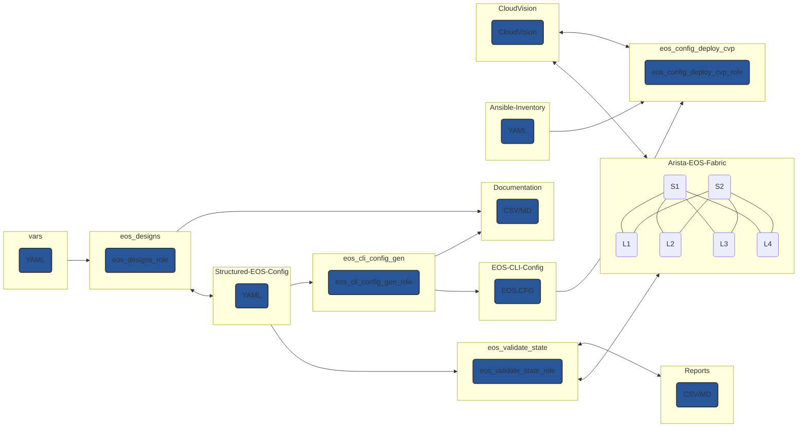

## Introduction

A while back, I was building a technical presentation. Like most presentations, this would include diagrams, code blocks, images, etc. So I did what any of us usually did and looked at something like Google Slides or Microsoft PowerPoint.

For the longest time, I wasn't a fan of how code blocks looked in these presentations or the gymnastics performed when taking a screenshot of some highlighted code or opening another app to create an image that would then be added to the presentation. After some searches on the internet, I was blessed with something incredible, Slidev.

## What is Slidev

Slidev is maintained by Anthony Fu and aims to be "Presentation Slides for Developers." I'm guessing Anthony was tired of running through certain hoops and figured, "Why not just make some presentation software that mimics what I do daily?"

I'll walk through some examples and my favorite features in a sec. Slidev makes the presentation-building workflow essentially like presentations as code. When building slides, developers and engineers can take advantage of using Markdown, CSS, and HTML.

## Getting started

Getting started with Slidev is as simple as one command (requires Node.js >= 14.0).

```shell
npm init slidev@latest
```

You will then be prompted to select a project name, if you would like to install it now, and what agent to use for the install. Example below.

```shell
❯ npm init slidev@latest
npx: installed 22 in 1.688s

  ●■▲
  Slidev Creator  v0.36.10

✔ Project name: … example
  Scaffolding project in example ...
  Done.

✔ Install and start it now? … yes
✔ Choose the agent › npm
```

The slides should open in your web browser automatically. You can run it manually using `npm run dev` if they don't. The slides will then be viewable at `localhost:3030`. By default, the slides can be modified at `slides.md`. In this case, I'll delete the built-in ones made by default and run through some examples.

## Favorite features

Slidev has so many features that breaking them all down would take a while. So instead, I'll run through some simple examples, but I highly encourage you to look at the official documentation (linked at the end).

### Creating in Markdown

The ability to create slides in Markdown format was huge for me. Learning the syntax for creating documentation (and slides) is nice and straightforward. Below is an example of the initial slide.

```markdown
---

# Welcome to the world of tomorrow

These slides are sweet!

---
```


### Themes

The default themes in Slidev are pretty sweet, but you can also use [custom themes](https://sli.dev/themes/gallery.html). I'm a fan of the [Purplin theme](https://github.com/moudev/slidev-theme-purplin), mainly for its support of a bottom bar. I can change the front matter at the top of the `slides.md` file and run `npm run dev`.

```yaml
---
# try also 'default' to start simple
theme: purplin
# random image from a curated Unsplash collection by Anthony
# like them? see https://unsplash.com/collections/94734566/slidev
background: https://source.unsplash.com/collection/94734566/1920x1080
# apply any windi css classes to the current slide
class: 'text-center'
# https://sli.dev/custom/highlighters.html
highlighter: prism
# show line numbers in code blocks
lineNumbers: false
# some information about the slides, markdown enabled
info: |
  ## Slidev Starter Template
  Presentation slides for developers.

  Learn more at [Sli.dev](https://sli.dev)
# persist drawings in exports and build
drawings:
  persist: false
# use UnoCSS
css: unocss
---
```

```shell
❯ npm run dev

> example@ dev /home/juliopdx/Documents/slidev-example/example
> slidev --open

? The theme "slidev-theme-purplin" was not found in your project, do you want to install it now? › (Y/n)
```

You'll lose the sweet image in your initial slide at this point, but that's okay for now. Next, I'll add another slide and include the bottom bar component with some additional Slidev features.

```markdown
---
layout: iframe-right

# the web page source
url: https://juliopdx.com
---

# Hello, world

- Some sweet blog from a random dude on the internet <mdi-terminal />
- Thank you for stopping by <mdi-check-box />

<BarBottom  title="Slidev Example">
  <Item text="JulioPDX">
    <carbon:logo-github />
  </Item>
  <Item text="@Julio_PDX">
    <carbon:logo-twitter />
  </Item>
  <Item text="juliopdx.com">
    <carbon:globe />
  </Item>
</BarBottom>
---
```

There is a lot going on here but stick with me.

- At the top, we have front matter for each slide representing a particular [layout](https://sli.dev/builtin/layouts.html) we may want.
- In this case, I chose an `iframe-right` to display a live web page as we go through a presentation. Imagine presenting project documentation on the fly.
- I added some random header of `Hello, world` and a list of information.
- A little subtle, but we can also add emojis all over the place.
- The bar bottom piece is almost a copy of the Purplin documentation. It allows you to present data at the bottom of each slide.


### Diagrams

Slidev supports mermaid diagrams which I thought was awesome. Below you will see a rough example I was working on showing some roles in the [Arista AVD Collection](https://avd.sh/en/stable/).

````markdown
---
layout: center
---

# Ansible AVD Collection



<BarBottom  title="Slidev Example">
  <Item text="JulioPDX">
    <carbon:logo-github />
  </Item>
  <Item text="@Julio_PDX">
    <carbon:logo-twitter />
  </Item>
  <Item text="juliopdx.com">
    <carbon:globe />
  </Item>
</BarBottom>
---
````


### Syntax highlighting

I honestly cant pick a favorite feature, but syntax highlighting might be it. You can create code blocks like any markdown document, and the code will be highlighted for you. Slidev can also highlight specific lines as you go through a presentation.

````markdown
---

# Colors <mdi-heart />

<br>
<br>

<div grid="~ cols-3 gap-2" m="-t-3">

```yaml {all|3-5}
api: 1

group: com.company
artifact: LoremIpsum
version: 1.0-SNAPSHOT
type: txt
```

```json {all|8-13}
{
  "water": [
    true,
    343168281.98631763,
    1364186132
  ],
  "sky": true,
  "strong": [
    {
      "stopped": "quickly",
      "kitchen": "knife",
      "after": -506746570.6858001
    },
    "began",
    true
  ]
}
```

```python {all|4}
my_numbers = [7, 7, 7]
first = "Julio"
last = "PDX"
print("Hello, world")
```

</div>

<BarBottom  title="Slidev Example">
  <Item text="JulioPDX">
    <carbon:logo-github />
  </Item>
  <Item text="@Julio_PDX">
    <carbon:logo-twitter />
  </Item>
  <Item text="juliopdx.com">
    <carbon:globe />
  </Item>
</BarBottom>
---
````

Again, a lot going on, but please stick with me.

- We added a small amount of HTML within the slide to lower the code blocks. We then split the slide into three columns. We could also use the layout called [`two-cols`](https://sli.dev/builtin/layouts.html#two-cols) in Slidev. But that only gets us two.
- We then added three code blocks, one for YAML, JSON, and Python.
- We can then ask Slidev to highlight portions of the code block as we go through the presentation. So, for example, `{all|3-5}` means, initially highlight everything, then on the next slide press, highlight lines three through five.

#### Start


#### A few click later


## Final thoughts and links

Thank you for reading this far. It means a lot. I hope you learned a bit about Slidev and give it a shot. I've had a blast working with it so far. I took a long blogging break but hope to ramp back up. Maybe slower than I was publishing before. I wish you all the best, and thanks again.

- [Slidev Documentation](https://sli.dev/)
- [Try it out in a playground](https://sli.dev/new)
- [Purplin Theme](https://github.com/moudev/slidev-theme-purplin)
- [Featrured image by Vincentiu Solomon](https://unsplash.com/photos/ln5drpv_ImI)
