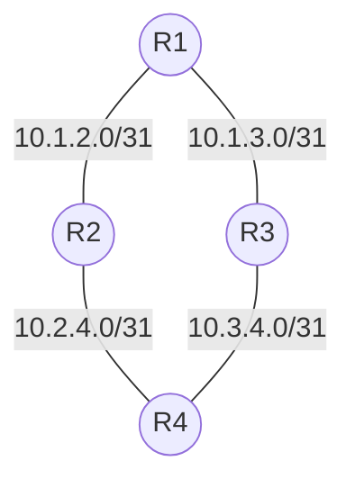


graph TD
  R1((R1)) --- |10.1.2.0/31| R2((R2))
  R1 --- |10.1.3.0/31| R3((R3))
  R2 --- |10.2.4.0/31| R4((R4))
  R3 --- |10.3.4.0/31| R4


Looking forward to adding this to future blog posts vs rendering images...
